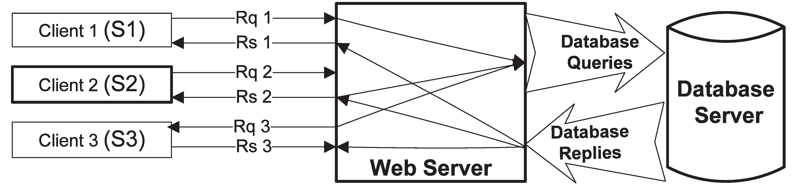

Partes de una Web
=================

Una aplicación web o un sito web (que es casi lo mismo) se puede dividir en dos grandres áreas el **Front-end** y el **Back-end**. 

##Front-end

Lado del cliente (**HTML, CSS, HTML5, CSS3, JavaScript, jQuery**). Es la parte del software que interactúa con el o los usuarios. Es el responsable de recolectar los datos de entrada del usuario, que pueden ser de muchas y variadas formas, y procesarlas de una manera conforme a la especificación que el *back-end* pueda usar.

Las personas encargadas del *front-end* tienden a ser programadores, pero hay diseñadores que también realizan *front-end*. Son los encargados de maquetar la estructura semántica del contenido (**HTML**), codificar el diseño en hojas de estilo (**CSS3**) y agregar la interacción con el usuario (**JavaScript**).

Actualmente los *front-ends* tienen **HTML5** y **CSS3**. Con **HTML5**, desde el *front-end*, es posible hacer geolocalización, dibujo vectorial, guardar datos en el disco del usuario, insertar audio y video, entre otras cosas.

Con **CSS3**, se pueden crear diseños altamente complejos sin la necesidad de imágenes cortadas, sólo usando código. Bordes redondeados, sombras, degradados, fondos múltiples, entre otros.

Por último, **JavaScript** y sus *frameworks* añaden el componente de interactividad y conexión al servidor. Es posible comunicarse con el **back-end** y la base de datos sin recargar la página usando **AJAX** o **WebSockets**, recibir esos datos y cambiar el diseño entero del sitio. **jQuery** hace todo esto fácil, pero no es el único *framework* de **JavaScript**.

##Back-end

Lado del servidor (**PHP, Ruby on Rails, Django, Node.js, .NET**). Es la parte que procesa la entrada desde el *front-end*. Por tanto son los procesos que utiliza el administrador del sitio con sus respectivos sistemas para resolver las peticiones de los usuarios.

Un programador tiende a ser **back-end**. Es la labor de ingeniería que compone el acceso a bases de datos y generación de plantillas del lado del *servidor*. En **back-end** se encargan de implementar cosas como **MySQL**, **Postgres**, **SQL Server** o **MongoDB**. Luego, un *lenguaje* como **PHP** o **JSP**, o *frameworks* como **RoR**, **Django**, **Node.JS** o **.NET** se conectan a la base de datos.

A través de estos *lenguajes* y *frameworks* se recibe, procesa y envía información al navegador del usuario. En código **HTML** (que crea el *front-end*) o enviando datos puros en **XML**, **RSS** o **JSON**, para ser procesados por **JavaScript**.
